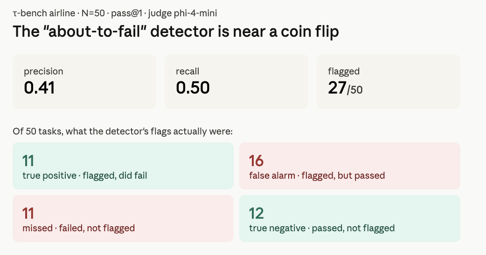

# Can you catch an AI agent's mistakes while it's making them?

I spent several weeks building a system to catch and correct an LLM agent's failures at runtime — intercept each tool call, check if it's about to do something wrong, inject a correction before it executes. The intuition is clean and the architecture fits on a whiteboard.

Then I measured it on [τ-bench](https://github.com/sierra-research/tau-bench), and two things turned out to be true:

1. **The intervention changed nothing.** Across 50 tasks it acted on 4, and flipped 0 of them. The score moved, but the movement was LLM run-to-run noise, not the intervention.
2. **The detector underneath it — the thing that decides whether a step is "about to fail" — is close to a coin flip.** Precision 0.41, recall 0.50 as a task-level failure predictor.

This repo is the write-up, the runs, and the measurement code. Everything below is reproducible from the files here. The short version of what I learned: *the hard part of agent reliability isn't catching mistakes. It's that the thing catching them is about as fallible as the thing it's watching.*

---

## Why I cared about this

Before any of this I was building production document-processing agents. The failure that stuck with me wasn't a crash — it was an agent reporting success while emitting a number that appeared nowhere in the source document. No exception, no error, a clean-looking result that was simply wrong.

Silent failure is the one that erodes trust, because you only find out downstream, after you've acted on it. So the obvious question: can you catch it *while the agent runs*, before the bad action commits? If you can, you can correct it, and if you can correct it, people can start trusting agents with work that matters.

That was the thesis. This is what happened when I tested it.

---

## The benchmark, briefly

τ-bench (Yao et al., 2024, Sierra Research) puts an LLM agent in an airline customer-service role with ~14 tools (`book_reservation`, `update_reservation_flights`, `cancel_reservation`, search and lookup tools, etc.). A second LLM plays the customer. A deterministic environment scores the run: reward is 1.0 only if the agent's *write* actions match the ground-truth set and the required facts show up in the final reply.

One detail drives everything that follows: **only writes are scored.** Reads are free. The agent can look up a user 20 times for nothing; what counts is whether `book_reservation` ends up with the right arguments. That's what makes runtime intervention look attractive on paper — every write is a checkpoint where you could, in principle, inspect the proposed action against everything already known and reject it if it's wrong.

Setup for everything below: airline domain, `test` split, tasks 0–49 (N=50), single trial (pass@1). Agent and user simulator both `moonshotai/kimi-k2` via OpenRouter.

---

## Experiment 1 — Runtime intervention: does correcting agents mid-run help?

### What it does

A host-side interceptor sits between the agent's tool-call decision and the environment. Every write hits it first: check the proposed call against cached read results and a set of detectors; if something looks wrong, return a synthetic tool error with repair instructions and let the agent retry once. One retry budget per call — repeated firing fails open (executes the original, logs the miss) so the agent can't get stuck in a correction loop.

I built this in four iterations, each one a response to how the previous one broke:

| Iteration | What I added | What broke |
|---|---|---|
| 1 | Deterministic "ungrounded ID" detector | Fired on perfectly grounded IDs — my extractor missed IDs that lived as dict *keys*, not `*_id` values. And the real reward-losing failures weren't hallucinated IDs anyway. |
| 2 | Hardened extraction + per-policy detectors | Each new pattern encoded more airline policy as Python. By detector #5 I was re-implementing the policy the LLM was supposed to read from its prompt. |
| 3 | LLM semantic verifier (catch what rules can't) | The verifier was exactly as wrong as the agent on the hard cases — sometimes corrected it in the *wrong* direction. And it added 20–50% token cost and 2–4s latency per write. |
| 4 | Demoted to observation-only drift detection | Useful for offline analysis. But it's no longer a controller — it doesn't change outcomes. |

I started at "intervene" and ended at "observe." That demotion is the honest result of the engineering, before any benchmark number.

### The clean A/B

To measure causal effect I ran the same 50 tasks twice, identical config, the *only* difference being whether the detector's findings get injected as corrections:

- **Run A (baseline):** intervention off
- **Run B (intervention):** intervention on

Detection runs in *both* — it just doesn't act in A. So the only behavioral difference is the injection.

| | pass | rate |
|---|---:|---:|
| A — intervention off | 28 / 50 | **0.560** |
| B — intervention on | 24 / 50 | **0.480** |
| Delta | −4 tasks | **−8.0 pp** |

At a glance this says intervention made things *worse* by 8 points. It didn't, and the reason is the most important thing in this experiment.

### Why the −8pp is noise, not the intervention

The intervention actually *acted* — blocked a call and injected a correction — on exactly **4 of 50 tasks**: 8, 9, 13, 48. All four had identical outcomes in both runs:

| task | gate that fired | A | B |
|---|---|---:|---:|
| 8 | `certificate_cardinality_before_book` | 0.0 | 0.0 |
| 9 | `certificate_cardinality_before_book` | 0.0 | 0.0 |
| 13 | `untrusted_or_unavailable_flight_tuple` | 1.0 | 1.0 |
| 48 | `booking_defaults_match_user_intent` | 1.0 | 1.0 |

Ten tasks flipped between the two runs (3 in B's favor, 7 against). **None of them is one of the 4 the intervention touched.** Every flip happened on a task the intervention never acted on — which means the flips are sampling noise between two stochastic LLM runs, not a causal effect. The intervention's true effect on this slice is: **4 tasks touched, 0 outcomes changed.**

That's the honest headline. Not "intervention hurts." *Intervention, at a realistic firing rate, did nothing measurable* — and the noise floor of a single-trial run is larger than the effect you're trying to detect.

---

## Experiment 2 — The detector: how good is the "about to fail" signal?

Intervention can only ever be as good as the detector deciding *when* to intervene. Since detection ran in both arms as an observation-only signal, the same runs answer a sharper question: **when the detector says a task is breaking, is it right?**

The signal is `would_break_task` — a boolean from an LLM "runtime monitor" that runs on every state-changing tool call. It gets the recent conversation, the recent trusted tool results, and an advisory expectation, and returns strict JSON flagging whether *this* action is likely to make the task fail. (Judge model here: `phi-4-mini-instruct`, temperature 0. The flag is further AND-gated by deterministic calibration that suppresses low-confidence fires — so it's not raw LLM output.)

To score it, a task is "flagged" if *any* monitored action in its trajectory was marked `would_break_task=true`, compared against the task's actual pass/fail (τ reward). N=50:

| arm | flagged | TP | FP | TN | FN | precision | recall | F1 |
|---|---:|---:|---:|---:|---:|---:|---:|---:|
| A (cleaner read) | 27 | 11 | 16 | 12 | 11 | **0.41** | 0.50 | 0.45 |
| B | 29 | 14 | 15 | 9 | 12 | 0.48 | 0.54 | 0.51 |



Read the A row plainly: it flags 27 of 50 tasks, **16 of those flags are false alarms** (the task actually passed), and it **misses 11 real failures**. Precision 0.41, recall 0.50. As a task-level failure predictor, this is barely better than guessing.

Both arms land in the same place, which is the cross-check you want — detection is the same observe-only signal in both runs, so it *should* agree with itself, and it does. (I treat A as the cleaner read because B's trajectories also contain the 4 injected corrections.)

> **Where the flags actually come from (worth being precise).** The detector ships a per-call LLM "runtime monitor," but in this run *every* `would_break_task` flag was raised by its **deterministic end-of-session check** — "did the agent finish without ever executing an expected terminal action?" The per-call LLM judge fired **zero** flags; the LLM's role was upstream, *predicting* which terminal actions to expect. So the 0.41 / 0.50 above is the precision/recall of a deterministic missing-action rule riding on an LLM-built expectation — not of per-call LLM judgment. It also scopes what could move the number: a stronger judge on the per-call path changes nothing (it already fires nothing); only a better *expectation*, or a correctness check the rule doesn't have, could.

This is the empirical version of the thing the intervention experiment ran into qualitatively: the cheap, fast signal isn't aligned with the failures that actually cost reward.

---

## What I actually take from this

Both experiments point at one wall. **You can't bootstrap a trustworthy agent from an automatic checker that's as fallible as the agent.** The deterministic detectors are precise only on the failures you could've caught with input validation. The LLM judge is general enough to catch the real failures but shares the agent's blind spots and costs as much as a second agent — because, functionally, that's what it is.

There's a softer, more useful version of the lesson too, the one I keep coming back to:

> If your detector is turning into a second agent, you've discovered that the agent is what you needed all along.

Every iteration where I made the detector "smarter" was really me rebuilding the correct agent next to the broken one. At which point the honest move isn't a better guardrail — it's a better agent, or a different place to intervene (planning, not the write boundary), or accepting that the part that can't be automated is the part that needs a human.

That last clause is where my thinking actually went. If the automatic layer that's supposed to make agents trustworthy is near chance, then trust doesn't come from a smarter detector. It comes from **accountability** — someone who owns the outcome. Intelligence is getting cheap fast. The ability to *answer for* what an autonomous system did is not. That's the gap I find more interesting than the next eval metric, and it's where this work pushed me next.

---

## Honest limitations

I'd rather you trust the parts that hold than oversell the whole. So, plainly, what this does *not* establish:

- **Single trial (pass@1).** Published τ-bench numbers are usually pass^4/pass^8. A one-shot run has a high variance floor — which is exactly why the −8pp is noise. Multi-trial would tighten everything here.
- **The detector is scored at a granularity it wasn't built for.** `would_break_task` is a *per-action* flag; I roll it up to per-task with a logical OR (any breaking action ⇒ task flagged) and score it against τ's per-task, outcome-only reward. So this measures whether its task-breaking flags track actual task failure — *not* whether it localizes the failing step, which is what it was designed to do. A correct flag on a task the agent later self-corrects counts here as a false positive.
- **Small judge model.** Detection ran on `phi-4-mini-instruct`. A frontier judge might clear the bar — this result is about *this* configuration, not "LLM detection is hopeless." Whether a stronger judge changes the picture is the obvious next experiment.
- **N=50, airline only, one agent model.** Numbers and behavior may not transfer to other domains or models.
- **Calibration-dependent.** The measured flag is post-calibration; a different calibration gives different numbers.

None of these soften the core finding — they scope it. The claim is narrow and I'd defend it: *a small-model, observation-only drift detector is near chance as a task-level failure predictor on this benchmark, and runtime intervention built on it changed nothing.*

---

## Reproduce it

```bash
# common env (both runs)
export OPENROUTER_API_KEY=...
export KAIROS_DRIFT_DETECTION_ENABLED=1
export KAIROS_SEMANTIC_EXPECTATION_ENABLED=true

# Run A — baseline (intervention off)
KAIROS_TAU_INTERVENTION_ENABLED=0 \
  .venv/bin/tau-openrouter --env airline --task-split test \
  --provider openrouter --model moonshotai/kimi-k2 --user-model moonshotai/kimi-k2 \
  --user-strategy llm --max-concurrency 2 --enable-kairos \
  --start-index 0 --end-index 50 --log-dir results/ab_runA

# Run B — intervention on (same command, flag flipped)
KAIROS_TAU_INTERVENTION_ENABLED=1 \
  .venv/bin/tau-openrouter ...same as above... --log-dir results/ab_runB

# measure: A/B effect + detection confusion matrix (both arms)
.venv/bin/python scripts/ab_measure.py \
  --a results/ab_runA_full.json --b results/ab_runB_full.json \
  --a-run-dirs data/runs/<run A kairos dirs> \
  --b-run-dirs data/runs/<run B kairos dirs>
```

**run_meta:** model `moonshotai/kimi-k2`; judge `phi-4-mini-instruct` @ temp 0; provider OpenRouter; env airline; split test; N=50; pass@1; agent strategy `tool-calling`; user strategy `llm`; dated 2026-06-20/21.

### Files

- [`results/ab_runA_full.json`](results/ab_runA_full.json) — baseline, 50 tasks
- [`results/ab_runB_full.json`](results/ab_runB_full.json) — intervention, 50 tasks
- [`results/ab_summary.json`](results/ab_summary.json) — computed summary
- [`scripts/ab_measure.py`](scripts/ab_measure.py) — A/B + detection-matrix computation

### Verify the numbers yourself

Every figure in this README is recomputed from the two committed result files — no trust required:

```bash
python scripts/ab_measure.py --a results/ab_runA_full.json --b results/ab_runB_full.json
# -> baseline 28/50 (0.560), intervention 24/50 (0.480), helped [0,6,30], hurt [2,4,16,17,20,21,32]
# -> detection A: precision 0.41 recall 0.50 ; B: 0.48 / 0.54
```

The detector confusion matrix above is the `--a` (baseline) arm of that output.

---

## Related work

- **[Kairos AI](https://github.com/akar5h/kairos-ai)** — the broader project this study came out of: an agent-tracing SDK + on-demand failure-clustering engine (OpenTelemetry → trace IR → analysis). This τ-bench study is the measurement that turned that work from "intervene at runtime" toward "observe, attribute, and own the outcome."
- The full benchmark harness (the `tau-openrouter` runner + Kairos host integration referenced in the reproduce block) lives in a separate repo; the result files + `ab_measure.py` here are sufficient to verify every number. Ask if you want harness access.

---

## A note on the benchmark

τ-bench is a good benchmark and nothing here is a criticism of it. The claim is about the *intervention and detection layer* I built on top, not the benchmark underneath. If you're at Sierra and want anything corrected, open an issue — happy to fix.

---

*Written up by [Akarsh Gajbhiye](https://akarshgajbhiye.com). If you're working on agent reliability and hit the same wall — or cleared it — I'd genuinely like to compare notes.*
